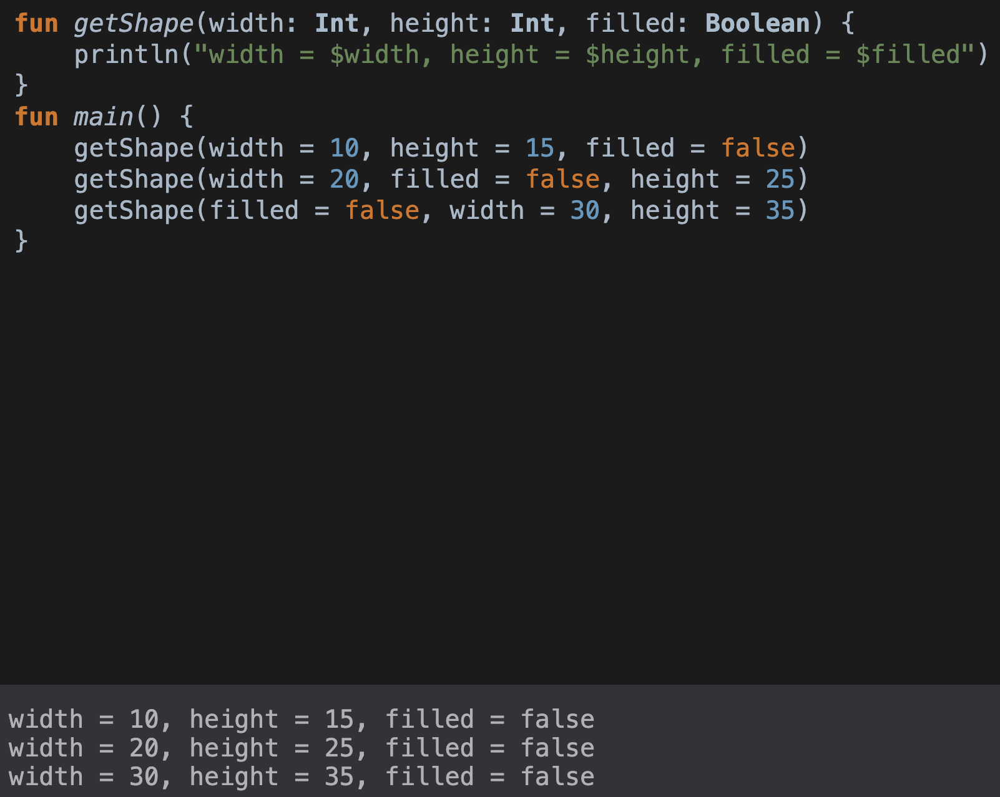

# 3장

## 컬렉션/문자열/정규식 관련 함수

```kotlin
fun <T> joinToString(
        collections: Collection<T>,  // generics on Collection
        separator: String,
        prefix: String,
        postfix: String
    ): String {
        val result = StringBuilder(prefix)
        for ((index, element) in collections.withIndex()) {
            if (index > 0 && index < collections.size) result.append(separator)
            result.append(element)
        }
        result.append(postfix)
        return result.toString()
    }
>>> val lsit = listOf(1,2,3)
>>> println(joinToString(list, "; ", "[", "]")
[1; 2; 3;]
```

코틀린 방식으로 작성하기 전 각종 요소를 확인

- 인자 이름 명시

```kotlin
joinToString(collections=list, separator = "; ", prefix = "[", postfix = "]")
```

- 디폴트 인자값 지정

인자  목록 중간 인자를 생략가능. 지정하고 싶은 인자 이름을 명시하여 순서 상관없이 지정가능

```markdown
fun getShape(width: Int, height: Int, filled: Boolean) {
    println("width = $width, height = $height, filled = $filled")
}

getShape(width = 10, height = 15, filled = false)
getShape(width = 20, filled = false, height = 25)
getShape(filled = false, width = 30, height = 35)
```



```kotlin
fun <T> joinToString(
        collections: Collection<T>,  // generics on Collection
        separator: String = ", ",
        prefix: String = "[",
        postfix: String = "]"
    ): String {
	...
}
```

자바에는 default parameter 개념이 없음. kotlin 함수가 파라미터 값을 제공해도 모든 인자 명시 필요

`@JvmOverloads` annotation 을 함수에 추가 시 마지막 파라미터부터 생략 가능 (파이썬과 같이)

→ 이는 annotation 으로 오버로딩한 함수가 만들어져, 모든 파라미터에 대해(순차적으로) 호출 가능

- 유틸리티 클래스 없애기

Java → 유틸성에 필요한 정적 메소드를 모아 생성 → JDK Collections 클래스

Kotlin → 함수는 최상위 수준. 즉 클래스 외부에 위치해도 무관

```kotlin
// join.kt
package strings

fun joinToString(...): String { ... }

// Java
package strings

public class JoinKt {
	public static String joinToString(...) { ... }

// 접근
// Kotlin
import strings.joinToString

joinToString(...)

// Java
import strings.JoinKt;

JoinKt.joinToString(...)
```

`@JvmName` annotation 으로 클래스명 지정가능

```kotlin
// 파일 상단에 추가
// join.kt
@file:JvmName("StringFunctions")
package strings

fun joinToString(...): String { ... }

// Java call
import strings.StringFunctions
StringFunctions.joinToString(...)
```

> 기본적으로 최상위 property로 지정한 값도 val-getter / var-getter&setter 가 생김
얼핏 보기에 상수 성격처럼 보이지만, 변수로 사용될 수 있어, 가급적이면 `const` 로 지정하는게 좋음 (`const val`)
> 

### 확장 함수 / 확장 프로퍼티 로 자바 라이브러리 적용

- **확장 function / 확장 property**

확장 함수


수신 객체 타입에 대한 함수를 명시하여 확장함수로 선언 & 사용 가능 (Groovy 등 JVM 언어로 작성된 클래스도 확장가능)

```kotlin
"Kotlin".lastChar() // n

// 수신객체 멤버에 this 생략 가능
// 다만 명시적이지 않아보임.. 실무에서는 명시하는게 더 뚜렷할수도?
fun String.lastChar(): Char = get(length - 1) 
```

확장 함수 특징

- 상속, 디자인패턴 없이 확장 기능을 생성가능
- 확장함수는 캡슐화를 깨지는 않는다
- boilerplate 코드 감소
- **정적 binding** 가능
    - static binding: compile 시점에 함수 호출 부분의 메모리 주소값 저장 이후 변경 X
    - Kotlin 에서의 static binding 은 아래의 특징을 가짐
        - 확장함수는 private, protected 멤버 접근불가
        - 클래스 멤버 함수와 동일한 이름의 확장함수 선언 시 멤버 함수가 우선 시
- 확장함수 호출 시 수신 객체로 지정한 변수의 정적 타입에 의해 결정
- 확장함수는 오버라이드할 수 없다


```kotlin
open class Shape {
    fun staticPrintShape() = "shape"
    open fun dynamicPrintShape() = "shape"
}

class Car: Shape() {
    override fun dynamicPrintShape() = "car"
}
fun Car.staticPrintShape() = "car"

fun printShape(shape: Shape) {
    println(shape.staticPrintShape()) // 확장함수[멤버함수 운선시]: shape 출력
    println(shape.dynamicPrintShape()) // 동적 바인딩: car 출력
}

fun main() {
    printShape(Car())
}
```


> **static binding & dynamic binding 예시**
> 

```kotlin
// static binding
// static, private, final method 해당 - override 불가능하여, compile 시점에 타입이 결정된다.
class Human {
   public **static** void walk() {
       System.out.println("Human walks");
   }
}
class Boy extends Human{
   public **static** void walk(){
       System.out.println("Boy walks");
   }
   public static void main( String args[]) {
       /* Reference is of Human type and object is Boy type */
       Human obj = new Boy();
       
       /* Reference is of Human type and object is of Human type */
       Human obj2 = new Human();
       
       obj.walk();  // Human walks
       obj2.walk(); // Human walks
   }
}

// dynamic binding
// method overriding
class Human {
   //Overridden Method
   public void walk() {
       System.out.println("Human walks");
   }
}
class Demo extends Human{
   // Overriding Method
   public void walk(){
       System.out.println("Boy walks");
   }
   public static void main( String args[]) {
       /* Reference is of Human type and object is Demo type */
       Human obj = new Demo();
       /* Reference is of Human type and object is of Human type.*/
       Human obj2 = new Human();
       
       obj.walk();  // Boy walks
       obj2.walk(); // Human walks
   }
}
```

**확장 property**

일반 property 와 유사. 수신 객체 클래스가 추가

var로 생성 가능

```kotlin
var StringBuilder.lastChar: Char
	get() = get(length - 1) // setter
	set(value: Char) {
		this.setCharAt(length - 1, value) // setter
	}
```

> 확장함수 사용 시 backing field를 사용할 수 없다
> 

```kotlin
// kotlin
// 커스텀 getter/setter (선언시)
class Person(_name: String) {
	var name: String = _name
    get() = "Sr. " + field
    set(value: String) {
        field = "Mr. " + value
    }
}

var person = Person("kim")
println(person.name) // Sr. kim

// 확장함수로 getter/setter 선언 시
class Person(_name: String) {
	var name: String = _name
}

var Person.name: String
  get() = "get extension name"
  set(value: String) {
      "set extension name"
  }

var person = Person("kim")
println(person.name) // kim

// backing field 명시 시
var Person.name: String
	get() = "Sr. " + field
  set(value: String) {
    field = "Mr. " + value
  }
// -> Unresolved reference: field 에러 발생
// 관련문서: https://kotlinlang.org/docs/extensions.html#extensions-are-resolved-statically
// 관련된 질문: https://stackoverflow.com/questions/36502413/extension-fields-in-kotlin
```

### Add-on: 정적바인딩 / 동적바인딩

바인딩(binding) - 지정한 변수 혹은 객체가 확정된 상태를 의미

정적 바인딩 - 컴파일(compile) 시 객체 타입이 정해짐

동적 바인딩 - 런타임(runtime) 시 객체 타입이 정해짐

```java
// java
// 정적 바인딩
class Person {
	private void move() { System.out.println("person moving"); }

	public static void main(String args[]) {
		Person p1 = new Person();
		p1.move();
	}
}

// 동적 바인딩
class Person {
		void move() { System.out.println("person moving"); }
}
class Doctor extends Person {
	void move() { System.out.println("doctor moving"); }

	public static void main(String args[]) {
		Person p1 = new Doctor();
		p1.move();
	}
}
```

동적 바인딩 시 `Doctor` 인스턴스는 `Person` 인스턴스이기도 하다. 위 예제는 상속에 따라 upcasting 으로 상위클래스로 형변환을 하여 명시하기에 동적바인딩이 가능.

- 정적 바인딩 - 객체 타입을 명시하기에 컴파일 시점(빌드시)에서 타입에 따라 바인딩된다. 빌드 시점에 타입에 따라 메모리 사용도가 정해져 메모리 효율성이 좋다. (final, private, static 메소드 등)
- 동적 바인딩 - 객체 타입을 런타임 시점에서 호출 시 결정되기에 유연성은 높다. 다만 가변적으로 가상 함수로 선언되어 메모리를 더 많이 필요하기에 효율성에서 좋지 않다.

| static binding | dynamic binding |
| --- | --- |
| compile 시점에서 바인딩 | runtime 시점에서 바인딩 |
| 일반 함수로 할당 (효율 up) | 가상 함수로 할당 (효율 down) |
| overloading (메소드 오버로딩) | overriding (상속) |
| private, final, static 메소드 등 | 실제 객체(real object) |

### 동적 바인딩(dynamic binding) 사용이유?

다형성(polymorphism)은 유연한 프로그램 설계를 가능하게 한다.

Java에서 한 타입의 참조 타입으로 여러개의 타입을 참조할 수 있도록 설계가 가능하다.

예를 들어, factory pattern에서 다형성을 통해 유연한 설계가 가능하다.

```java
// java
public interface Animal {
	void howl();
}

public class Dog implements Animal {
	@Override
	public void howl() {
		System.out.println("woof");
	}
}

public class Cat implements Animal {
	@Override
	public void howl() {
		System.out.println("meow");
	}
}

// factory
public enum AnimalName {
	CAT, DOG;
}

public class AnimalFactory {

	private final EnumMap<AnimalName, Animal> animalsMap;

	public AnimalFactory() {
		Dog dog = new Dog();
		Cat cat = new Cat();		

		this.animalsMap = new EnumMap<>(AnimalName.class);
		this.animalsMap.put(AnimalName.DOG, dog);
		this.animalsMap.put(AnimalName.CAT, cat);
	}

	public Animal getAnimal(AnimalName animalName) {
		return this.animalsMap.get(animalName);
	}

	public void main() {
		AnimalFactory animalFactory = new AnimalFactory();
		Animal dog = AnimalFactory(AnimalName.DOG);
		dog.howl(); // woof
	}
}
```

위와 같이 `Animal` 에 인터페이스를 구현하는 `Dog`, `Cat` 클래스의 인스턴스를 생성하는 factory `AnimalFactory` 를 선언할 때, enum 타입으로 인터페이스 구현 클래스들을 군집시키고, `Animal` 상위클래스 타입으로 반환하게끔 다형성을 고려한 설계가 가능하다.

위의 경우, 동적 바인딩으로 실행 시 타입을 정하기 때문에 메모리 사용량은 높지만, 유연한 설계와 코드 가독성을 가져갈 수 있다.

위 Java 코드의 Kotlin 코드 작성 예시

```kotlin
// kotlin
import java.util.*

interface Animal {
  fun howl()
}

class Dog: Animal {
  override fun howl() = println("woof")
}
class Cat: Animal {
  override fun howl() = println("woof")
}

enum class AnimalName {
  CAT, DOG;
}

class AnimalFactory() {
  val animalsMap:EnumMap<AnimalName, Animal> = EnumMap<AnimalName, Animal>(AnimalName::class.java)
  val dog:Dog = Dog()
  val cat:Cat = Cat()

  init {
    animalsMap.put(AnimalName.DOG, dog)
    animalsMap.put(AnimalName.CAT, cat)
  }

  fun getAnimal(animalName: AnimalName): Animal { // dynamic binding: polymorphism
    return animalsMap.get(animalName)!!
  }

  fun main() {
    val animalFactory = AnimalFactory()
    val dog = animalFactory.getAnimal(AnimalName.DOG);
    dog.howl() // woof
  }
}
```

## 인자, 디폴트 파라미터값, 중위호출문법

`vararg` : 인자 개수가 달라지는 함수 정의

spread operator(*)로 전달 가능

```kotlin
fun main(args: Array<String>) {
	val list = listOf("args", *args) // spread operator
	println(list)
}
```

중위 함수 호출 구문 (inflix func call): 고유한 메소드를 간편히 호출

```kotlin
val map = mapOf(1 to "one", 7 to "seven", 50 to "fifty")

1.to("one") // 일반 호출
1 to "one"  // 중위 호출

// to 는 확장함수
```

이러한 호출이 가능한 이유는 구조 분해 선언이 가능하기 때문

구조 분해 선언(destructuring declaration): 값 분해


```kotlin
for ((index, value) in collection.withIndex()) {
	println("${index}: ${value}")
}

// 함수 선언부
fun <K, V> mapOf(vararg values: Pair<K, V>): Map<K, V>
```

- 정규식 처리

```kotlin
"12.345-6.A".split(".", "-") // [12, 345, 6, A] : 여러 구분자 지정가능
```

혹은 regex 적용가능


### 최상위 / 로컬 함수, 프로퍼티를 사용한 코드 구조화

DRY 원칙

Before


After


---