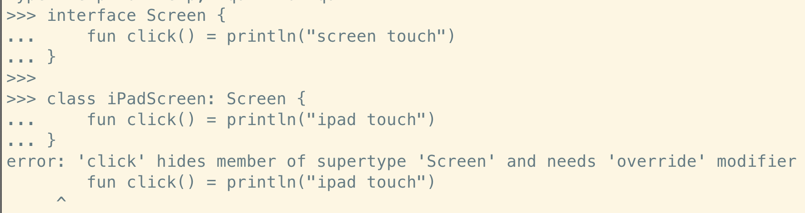
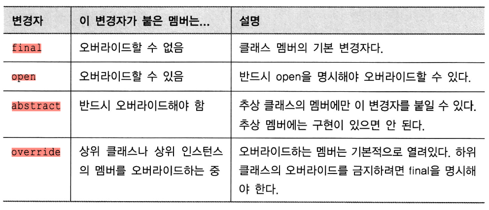

# 4장

- 클래스/인터페이스
- 뻔하지 않은 생성자/프로퍼티
- 데이터 클래스
- 클래스 위임
- object 키워드 위임

---

- kotlin 기본 선언 속성: `final` (상속관계: final / open) `public` (접근제어: public / private / procted, internal)

### 클래스 계층

- interface

```kotlin
interface Clickable {
	fun touch()
}

class Screen: Clickable { // implementation
	override fun click() = println("screen touch")
}
Screen.click()
```

비추상 클래스(구체적 클래스)는 인터페이스에 대한 구현을 제공해야함

- 클래스 - 클래스 (1:1)
- 클래스 - 인터페이스 (1:N) - 단 구현 필요

코틀린은 `override` 변경자 필수 명시 - 상위/하위가 동일한 선언 시 컴파일에러




단, 디폴트 구현이 되어 있는 경우는 에러 발생 X

```kotlin
interface Screen {
	fun click() = println("screen touch")
}

class iPadScreen: Screen {
	override fun click() = println("ipad touch")
}

interface Screen {
	fun click()
	fun swipe() = println("screen swipe")
}

interface Trackpad {
	func click()
}
class iPadScreen: Screen, Trackpad {
	override fun click() = println("ipad touch")
}
```

한 클래스에서 두 인터페이스를 구현 시, 별도로 명시하지 않는 경우 어느쪽도 선택 X

구현을 대체할 오버라이딩 메소드를 제공해야함


책 예시와 같이 하나의 클래스가 2개의 인터페이스 구현

```kotlin
interface Screen {
	fun click() = println("screen touch")
}

interface Button {
	fun click() = println("button touch")
}

class iPad: Screen, Button {
	override fun click() { // screen touch & button touch
		// 혹은 별도 로직 구현
		**super<Screen>.click() // 오버라이드 명시 <> generics**
		**super<Button>.click() // 오버라이드 명시**
	}
}
```

> 자바에서는 코틀린의 default 메소드 구현에 의존 불가
> 예시: [https://velog.io/@picbel/Kotlin에서-interface-default-구현시-주의할-점](https://velog.io/@picbel/Kotlin%EC%97%90%EC%84%9C-interface-default-%EA%B5%AC%ED%98%84%EC%8B%9C-%EC%A3%BC%EC%9D%98%ED%95%A0-%EC%A0%90)
> 그외: [https://whyprogrammer.tistory.com/627](https://whyprogrammer.tistory.com/627)

### open, final, abstract, final

final - 기본값. 상속 금지. (상수)

fragile base class(취약 기반클래스) - 상속 방법에 대한 규칙 미제공 시 의도와 다르게 오버라이드 가능.

상속을 위해선 `open` 변경자를 붙인다

```kotlin
interface Screen {
	fun click() = println("screen touch")
}

open class iPad : Screen {
	override fun click() = println("screen touch") // 현재 클래스 상위 클래스의 메소드 오버라이드
	open fun swipe() = println("screen swipe") // 하위 클래스에서 오버라이드 가능
	fun animate() = println("screen animate") // 하위 클래스에서 오버라이드 불가
}

open class iPadmini : iPad() {
	final override fun click() = println("mini") // 해당클래스의 하위클래스에서는 오버라이드 불가
	override fun animate() = println("iPad mini animate") // 오버라이드 불가
}

open class iPadmini5 : iPadmini() {
	override fun click() = println("mini5") // 오버라이드 불가
}
```


- `abstract` 로 선언한 추상클래스는 상속만 가능. 인스턴스화 불가 (즉 항상 open. 명시필요X)

### **추상클래스와 인터페이스의 공통점/차이**

**추상클래스**

`abstract class` 로 명시

상속으로 하위 클래스에서 구현하도록 강제

추상클래스는 인스턴스 생성불가

다중상속 불가

추상메소드로 선언부 작성. 구현부는 상속받는 하위 클래스의 구현에 따라 달라짐

- 상속/확장이 목적
- 공통된 클래스의 구분을 추상 클래스 상속으로 명시
- 다중상속 불가
- 다형성 개념 X

**인터페이스**

`interface` 로 명시

상수, 추상메소드의 집합

추상 클래스보다 추상화 정도가 높음

구현부가 있는 메소드, 멤버변수를 가질 수 없음 (멤버변수는 `public static final` 로 선언가능)

인터페이스는 가급적이면 `~able` 네이밍 규칙을 사용하며, 이를 구현하는 구현체는 `~Impl` 네이밍을 쓰는 경우가 많다

- 제한이 목적
- 서로다른 클래스에 목적에 맞는 기능(메소드)를 구현하도록 명시
- 다중상속 가능
- 다형성 적용가능: 동일한 인터페이스를 가지나, 구현이 다른 서로다른 클래스로 정의
- 구현체가 많아지는 상황에 사용

](asset/04_클래스_객체_인터페이스/Untitled%204.png)

[https://wildeveloperetrain.tistory.com/112](https://wildeveloperetrain.tistory.com/112)



### 가시성 변경자 (public, protected, private)

캡슐화 제공. 의존하는 외부 코드를 깨지 않고 클래스 내부 구현 가능

최상위 선언에 대해 `private` 가시성 허용 → 동일한 `.kt` 파일 내에서 접근이 가능하다. Java 는 파일 당 클래스를 선언하지만, Kotlin은 파일 내 여러 최상위 선언이 가능하다.

```kotlin
// example.kt

private fun test1() = println("test1")

private fun test2() {
    test1()
    println("test2")
}

fun main() {
	test1() // test1
  test2() // test1 & test2
}
```


```kotlin
package testModule
internal open class test { // internal: 접근제어자 / open: 상속가능여부명시
	private fun privateMethod() = println("private")
	protected fun protectedMethod() = println("protected")
	open fun testOpen() {
		privateMethod()
		protectedMethod()
	}
}
fun test.openMethod() { // 확장함수는 클래스내에 선언한 메소드와 다르게 private, protected 접근 불가 -> 에러
	privateMethod()
	protectedMethod()
}
```


> 클래스 기반 타입 목록 내의 타입 / 제네릭 클래스 타입 파라미터의 타입 가시성은 클래스 자신의 가시성과 같거나 더 높아야 한다.
메소드의 시그니처에 사용된 모든 타입의 가시성은 메소드의 가시성과 같거나 더 높아야 한다.
**private < protected < internal < public**
> 

> protected 는 해당 클래스와 그 클래스를 상속한 클래스 내에서만 보임. 클래스를 확장한 함수는 클래스의 private/protected 멤버에 접근 불가 
문서 참고: [https://kotlinlang.org/docs/extensions.html#note-on-visibility](https://kotlinlang.org/docs/extensions.html#note-on-visibility)
> 

코틀린에서 접근 불가 대상을 자바에서는 접근 가능한 경우도 있다.

### 중첩 클래스


`State` 인터페이스 - `ButtonState` 클래스

```kotlin
public class Button implements View { 
	@Override
	public State getCurrentState () {
		return new ButtonState();
	}
	@Override
	public void restoreState (State state) { /* ... */ }
	public class ButtonState implements State { /* ... */ } // 에러 발생
}
```

위에서 `ButtonState` 클래스는 `static` 명시가 필요하다 (중첩클래스)

```kotlin
class Button : View (
	override fun getCurrentState(): State = ButtonState()
	override fun restoreState(state: State) { /* ... */ }
	class ButtonState : State { / *... */ } // 중첩클래스
}
```

코틀린 중첩 클래스 - 별도 키워드 없으면 `static` 중첩 클래스

```kotlin
// java --> **이것도 찾아보자!**
public class A {
	public static class B
}
A -> 초기화
A.B.something -> 가능 (B초기화 필요없음)
public class A {
	public class B
}
A -> 초기화
B -> 초기화
B -> A 접근하는 과정에서 (만약 A가 초기화X?) -> 오류?

// kotlin
class A
	class B
```


내부클래스(Inner) 안에서 바깥클래스(Outer) 참조 시 `this@Outer` 로 접근

- `sealed` class: 봉인된 클래스

```kotlin
interface Expr
class Num (val value: Int) : Expr
class Sum(val left: Expr, val right: Expr) : Expr

fun eval (e: Expr): Int = when (e) {
	is Num - > e.value
	is Sum -> eval(e.right) + eval(e.left)
	else ->
		throw IllegalArgumentException("unknown expression")
}
(1+2)-1
```

`else` 로 기본 분기를 명시해야함. 

만약 `Expr` 구현체를 `Num` / `Sum` 으로 고정하여 사용하도록 `eval` 함수를 사용한다면, 조건에서 기본 분기를 처리할 필요가 없다. 오히려 기본분기로 인해 처리가 되지 않아 오류가 발생할 수 있고, 디버깅을 위한 코드 파악이 늦어질 수 있다. 

이러한 경우에 `sealed` 클래스를 사용하여 처리가능. `sealed` 클래스는 자동으로 `open` 접근제어자를 가짐

- `sealed` class 는 같은 패키지내 자식 클래스로만 상속가능 (컴파일러가 전체 패키지를 스캔하는 경우를 대비)
- `sealed` class 는 추상클래스(abstract)로 인스턴스 생성이 불가

```kotlin
sealed class Expr {
	// sealed 클래스와 이를 상속받는 클래스
	class Num(val value: Int) : Expr ()
	class Sum(val left: Expr, val right: Expr) : Expr()
}
fun eval(e: Expr): Int = 
	when (e) {
		// sealed 클래스 상속관계를 컴파일러가 인지하고 있기에
		// when 분기처리 시 기본분기 없이 상속한 클래스의 분기만 명시가능
		is Expr.Num -> e.value
		is Expr.Sum -> eval(e.right) + eval(e.left)
	}

// 새로운 sealed 클래스의 자식 클래스 추가 시
sealed class Expr {
	class Num(val value: Int) : Expr ()
	class Sum(val left: Expr, val right: Expr) : Expr()
	class Diff(val left: Expr, val right: Expr) : Expr()
}
fun eval(e: Expr): Int = 
	when (e) {
		is Expr.Num -> e.value
		is Expr.Sum -> eval(e.right) + eval(e.left)
		// Diff에 대한 when 구문 명시가 되어 있지 않아 에러가 발생한다.
		// is Expr.Diff -> eval(e.right) - eval(e.left) 를 추가해야하 정상작동
	}
```

> 위 예제에서 상속받은 클래스는 class 대신 object 로 싱글톤 패턴으로 처리하면 하나의 인스턴스만 생성하여 메모리 사용성을 줄일 수 있다.
> 


> `sealed` 클래스는 내부적으로 `private` 생성자를 가지며, 클래스 내부에서만 호출 가능하다
> 

### 주생성자 / 부생성자

```kotlin
class User constructor(_name: String) {
	var name: String
	var gender: String = "nothing"
	init {
		name = _name
	}
}
val user = User("name")
val user = User("name", live = true)

class Person {
	var name: String
	var gender: String

	init {
		this.name = ""
		this.gender = ""
	}

	constructor(_name: String) {
		this.name = _name
	}
	constructor(_name: String, _gender: String = "woman") { // default parameter
		this.name = _name
		this.gender = _gender
	}
}
val p1 = Person("name")
val p2 = Person("man", "name")
```

상속 클래스에서 기반 클래스를 초기화 시 기반 클래스 뒤 괄호와 같이 생성자 인자를 넘긴다

```kotlin
open class User(val name: String) { ... }
class FaceBookUser(name: String) : User(name) { ... }
```

만약 클래스를 외부에서 인스턴스화 하지 않게 막기위해선 모든 생성자를 `private` 으로 정의

```kotlin
class SecretUser private constructor() {}
```

### 부생성자

```kotlin
open class View {
	constructor{ctx: Context) (
		...
	}
	constructor(ctx: Context, attr: AttributeSet) {
		...
	}
}

class MyButton : View {
	constructor(ctx: Context)
		: super (ctx) {
		...
	}
	constructor(ctx: Context, attr : AttributeSet)
		: super(ctx , attr) (
		...
	}
}
```


하위 클래스의 생성자가 상위 클래스 생성자에게 객체 생성 위임

```kotlin
class MyButton : View {
	constructor(ctx:Context): this(ctx,MYSTYLE) {
		...
	}
	constructor(ctx: Context, attr: AttributeSet): super(ctx, attr) {
		...
	}
}
```


부 생성자가 필요한 주 이유: 자바 상호운용성 (파라미터 목록에 따른 여러 생성 방법)

- 인터페이스 내 프로퍼티 선언에 backing field, getter 정보가 들어있지 않다

```kotlin
interface User {
	val email: String
	val nickname: String
}

class SubscribingUser (val email: String) : User {
	override val nickname : String
		get() =email.substringBefore(’@’) // custom getter
}
class FacebookUser(val accountld : Int) : User (
	override val nickname = getFacebookName (accountld) // property 초기화 식
}
```

- 인터페이스는 추상 프로퍼티 외에도 getter/setter 가 있는 프로퍼티 선언가능

```kotlin
interface User (
	val email: String
	val nickname: String
		get () = email.substringBefore(’@’) // no backing field
}
```

위는 email / nickname(custom getter) → 이를 구현하는 하위 클래스는 email 오버라이딩으로 구현이 필수. nickname 은 오버라이딩 없이 상속 가능

- 프로퍼티 수정 시 필드 설정 구문 사용 `classInstace.field_name = new_value`
- field 를 사용하지 않는 커스텀 접근자 구현시 backing field는 존재하지 않는다

### 접근자 가시성 변경


접근자 가시성은 기본적으로 프로퍼티 가시성과 동일.

`laneinit` 변경자로 선언하는 지연 초기화 프로퍼티는 위임 프로퍼티 → 뒤에 다룸

### 컴파일러 기본 생성 메소드

`equals` `hashCode` `toString` 등

**toString()**

기본적으로 `ClassName@hashValue` 로 표현. 클래스 인스턴스에 대한 표현식으로 사용

**equals()**


자바에서는 == 로 원시타입/참조타입 비교시 사용.


위에서 `other == null || other !is Client` 는 `other !is Client` 로 표시 가능

> 왜 why? → `Any?`  로 nullable type 이기 때문. 뒤에 설명
> 

**hashCode()**

`equals()` 사용시 비교 객체는 모두 동일한 `hashCode()` 를 가져야한다. 이를 가지고 비교.

간단정리

- equals() - 인스턴스 비교 (hashCode() 사용)
- hashCode() - 해시 기반 컨테이너에서 키로 사용
- toString() - 클래스 각 필드 선언을 표시하는 문자열 표현

**copy()**

데이터 클래스는 가급적이면 immutable 클래스로 만들기를 권장.

불변 객체로 사용할 경우, 멀티스레드 간 데이터를 변경 불가하기 때문에 스레드 동기화의 필요성이 줄어듬. (singleton OR sync annotation)

`copy()` 는 원본과 다른 생명주기를 가지며, 원본을 참조하는 다른 부분에 영향을 끼치지 않음
(깊은 복사: 서로 다른 객체)

> **관련 키워드: 깊은 복사 / 얕은 복사**
> 

### **by 키워드**

하위 클래스는 상위 클래스 세부 구현 사항에 의존

→ 상위 클래스 변경 시 가정이 깨져 코드가 정상작동하지 않는 경우 발생

→ 클래스에 새로운 동작 추가 (decorator pattern)

→ 상속을 허용하지 않는 클래스 대신 사용가능한 클래스로 만들고, 기존 클래스와 같은 인터페이스에 데코레이터 제공

→ 기존 클래스는 데코레이터 내부에 필드로 유지

설명이 어려우니 예시로 이해해보자


`CountingSet` 의 위임 대상 내부 클래스 → `MutableCollection`

내부 클래스 `MutableCollection` 의 API가 변경되지 않는 한 `CountingSet` 정상작동

이는 자바와의 차이점을 봐야함

```kotlin
// kotlin
class CountingSet<T>(val innerSet: MutableCollection<T> = HashSet<T>()) :
    MutableCollection<T> by innerSet { // MutableCollection의 구현을 innerSet에게 위임

    var objectsAdded = 0

    // 아래 두 메소드는 위임하지 않고 새로운 구현을 제공한다.
    override fun add(element: T): Boolean {
        objectsAdded++
        return innerSet.add(element)
    }

    override fun addAll(c: Collection<T>): Boolean {
        objectsAdded += c.size
        return innerSet.addAll(c)
    }
}

// Java
public final class CountingSet implements Collection, KMutableCollection {
   @NotNull
   private final Collection innerSet;
   private int objectsAdded;

   // ... constructors
   
   public boolean add(Object element) { 
      int var2 = this.objectsAdded++;
      return this.innerSet.add(element); 
   }

   public boolean addAll(@NotNull Collection c) {
      this.objectsAdded += c.size();
      return this.innerSet.addAll(c); 
   }

   @NotNull
   public final Collection getInnerSet() { return this.innerSet; }

   public int getSize() { return this.innerSet.size(); }

   public void clear() { this.innerSet.clear(); }

   public boolean contains(Object element) { return this.innerSet.contains(element); }

   public boolean containsAll(@NotNull Collection elements) { return this.innerSet.containsAll(elements); }

   public boolean isEmpty() { return this.innerSet.isEmpty(); }

   @NotNull
   public Iterator iterator() { return this.innerSet.iterator(); }

   public boolean remove(Object element) { return this.innerSet.remove(element); }

   public boolean removeAll(@NotNull Collection elements) { return this.innerSet.removeAll(elements); }

   public boolean retainAll(@NotNull Collection elements) { return this.innerSet.retainAll(elements); }

   public final int getObjectsAdded() { return this.objectsAdded; }

   public final void setObjectsAdded(int <set-?>) { this.objectsAdded = <set-?>; }

   public CountingSet() { this((Collection)null, 1, (DefaultConstructorMarker)null); }

   public final int size() { return this.getSize(); }

   public Object[] toArray(Object[] array) { return CollectionToArray.toArray((Collection)this, array); }

   public Object[] toArray() { return CollectionToArray.toArray((Collection)this); }
}

// 참고 블로그: https://gngsn.tistory.com/214
```


### object(객체) 키워드

singleton 객체 생성

```kotlin
object payroll { // payroll.hashCode() -> eㅗㅇ일한 값. 즉, 싱글톤패턴
	val allErnployees = arrayListOf<Person> ()
	fun calculateSalary() {
		for (person in allErnployees) {
			...
		}
	}
}
```

객체 선언에는 생성자를 쓸 수 없다. 즉, singleton 객체는 객체 선언문이 있는 곳에서 생성자 호출 없이 즉시 생성

객체 선언에 대한 생성자 정의가 필요 없음

> 특정 프레임워크를 제외하고 여러 프로그램에서 다양한 구성/ 상호작용을 위한 컴포넌트에는 singleton 이 부적절. 객체 생성 제어 불가 & 생성자 파라미터 지정 불가
> 

만약 한 클래스의 여러 인스턴스에 대한 구분을 위한 클래스가 필요하다 → singleton 활용가능

```kotlin
data class Person(val name: String) {
	object NameComparator : Comparator<Person> {
		// 초기화 시점: 컴파일시점/로드시점
		override fun compare(p1: Person, p2: Person): Int = p1.name.compareTo(p2.name)
	}
}
```

### 동반 객체

코틀린에서는 클래스 내 정적멤버 X

대신 패키지 내 최상위 함수/객체선언을 활용 (대부분 최상위 함수 활용) → 객체 초기화 없이, 연관되어 있지 않은 property, method를 연결시켜 볼 수 있음.

```kotlin
class A {
	companion object {
		fun bar() {
			println("companion object")
		}
	}
}
>>> A.bar() // -> A > object(companion) > bar()
```


> private 생성자를 호출하기 좋은 위치 ⇒ 동반객체
> 

이를 활용해서 factory pattern 을 구현하기 가장 적합하다

```kotlin
// BEFORE
class User {
	val nickname: String
	constructor(email: String) {
		nickname = email.substringBefore(’@’)
	}
	constructor(facebookAccountld: Int) (
		nickname = getFacebookName(facebookAccountld)
	}
}

// AFTER
class User private constructor(val nickname: String) {
	companion object {
		fun newSubscribingUser(email: String) = User(email.substringBefore(’@’))
		fun newFacebookUser (accountld: Int) = User(getFacebookName(accountld))
	}
}

>>> val subscribingUser = User.newSubscribingUser("bob@gmail.com")
>>> val facebookUser = User.newFacebookUser(4)
```

클래스가 따로 존재하면, 상황에 따라 클래스를 반환 가능.

생성할 필요가 없는 객체를 생성하지 않고, 이미 존재하는 인스턴스를 캐시로부터 받아 전달도 가능

```kotlin
class Person(val name: String) { 
	companion object Loader {
		fun fromJson(jsonText: String): Person = ...
	}
}
>>> person = Person.Loader.fromJSON("{name : ’Dmìtry ’ }")
>>> person.name
>>> person2 = Person.fromJSON("{name: ’Brent’}")
>>> person2.name
```

> 별도로 companion class 명 미정의시 기본값은 `Companion`
> 

장점

- Person 은 비즈니스 로직 모듈
- fromJson 은 클라/서버 통신 모듈에 포함 (대부분)
- 아래와 같이 비즈니스 로직 / 통신 모듈 로직을 분리하여 명시하되, 동반 객체를 통해 호출 가능. (실제는 멤버함수가 아님. 확장함수)

```kotlin
// 비즈니스 로직 모듈
class Person(val firstName: String, val lastName: String) {
	companion object {
	}
}
// 클라/서버 통신 모듈
fun Person.Companion.fromJSON(json: String): Person {
	...
}

>>> val p = Person.fromJson(json)
```

### 객체 식

무명객체 (anonymous object)

```kotlin
window.addMouseListener(
	object: MouseAdapter () (
		override fun mouseClicked(e: MouseEvent) (
			...
		}
		override fun mouseEntered(e: MouseEvent) {
			...
		}
	}
}
```

위와 같이 object: ~ 로 무명객체를 정의하면 별도 클래스 정의 없이 외부 의존성에 필요한 구현체를 정의하여 대입 가능하다. (재사용성은 고려하지 않음)

여러 인터페이스를 구현하거나 클래스를 확장하면서 인터페이스 구현이 가능


객체 식은 무명 객체 안에 여러 메소드를 오버라이드 하는 경우에 유용하다.

→ kotlin 베이스로 작성한 안드로이드 코드에서 이벤트 리스너 혹은 스프링의 configuration 에서 http filter 등을 설정할 때 자주 사용될 것으로 보임